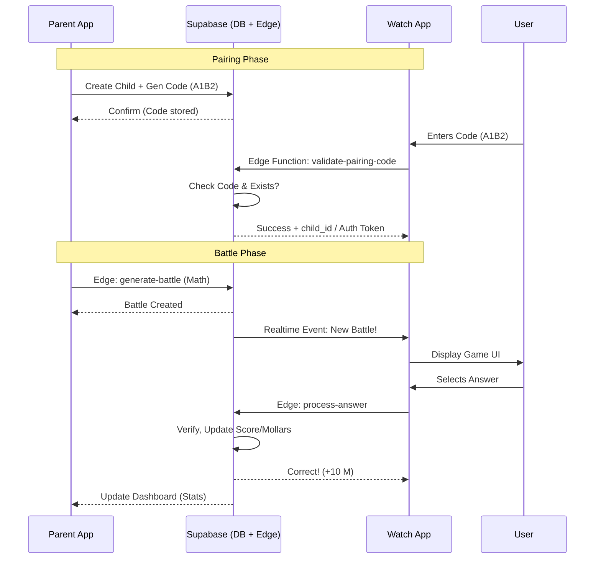

# Parent App & Child Watch OS Interaction Architecture

This document describes the technical and functional architecture of how the Parent App (React Native/Expo) communicates and synchronizes with the Child's Watch App (Native SwiftUI).

## High-Level Overview

The ecosystem relies on a **centralized Supabase backend** as the single source of truth. There is no direct peer-to-peer (P2P) communication (like Bluetooth) between the phone and the watch. Instead, all synchronization occurs via the cloud, ensuring that parents can manage the game from anywhere, and children can play without needing the parent's device nearby (provided the Watch has connectivity).

### Core Components
*   **Parent App (iOS/Android)**: The "Command Center" for creating accounts, managing families, assigning tasks, and initiating battles.
*   **Watch App (watchOS)**: The "Player Interface" for the child to play game battles, check off chores, and customize their avatar.
*   **Supabase (Backend)**: Handles Auth, Database (PostgreSQL), Edge Functions (server-side logic), and Realtime subscriptions.

---

## 1. The Pairing Process (The "Handshake")

Security involves a secure, low-friction "pairing code" mechanism to link a generic Watch App installation to a specific child record in the Parent's family.

### Workflow:
1.  **Generation (Parent App)**: 
    *   In the Dashboard (`app/dashboard/add-child.tsx`), the parent acts to "Add Child".
    *   The app generates a unique **6-digit alphanumeric code** (e.g., `A7X9P2`).
    *   This code is saved to the `children` table in the `pairing_code` column, along with an expiration timestamp (`pairing_code_expires`), typically 24 hours.

2.  **Input (Watch App)**:
    *   Upon first launch, the Watch App presents the `PairingView`.
    *    The child (or parent) enters the 6-digit code.

3.  **Validation (Edge Function)**:
    *   The Watch App invokes the `validate-pairing-code` Supabase Edge Function via `APIService`.
    *   **Logic**:
        *   Standardizes input (case-insensitive).
        *   Queries database for matching, non-expired `pairing_code`.
        *   If valid: Links the Watch session to that `child_id` and marks the specific Child record as "Paired" (or clears the expiration to finalize).
    *   **Success**: The Watch App receives the `child_id` and transitions to the `MainMenuView`.

---

## 2. Syncing & Communication Patterns

### Shared Database Tables
Both apps read and write to the same schema:
*   `functions`: Logic for battles and pairing.
*   `children`: Profiles, avatar config, Mollar balances.
*   `battles`: Game instances and states.
*   `validation_tasks`: Chores and behavioral tasks.
*   `validation_requests`: Queue for parent approval.

### Synchronization Mechanisms
| Feature | Sync Method | Description |
| :--- | :--- | :--- |
| **Battles** | **Realtime** | The `battles` table has Realtime enabled. The Watch App subscribes to changes to know immediately when a parent starts a battle. |
| **Tasks/Chores** | **Polling / Fetch** | The Watch App fetches tasks (`TasksView.swift`) when the view loads or refreshes. |
| **Avatar** | **Write-heavy** | Watch App writes to `children.avatar_config`. Parent App reads this to display the avatar. |
| **Mollars (Currency)** | **Transactional** | Updates are atomic transactions in the DB to prevent syncing errors. |

---

## 3. Feature-Specific Data Flows

### A. Battles (Educational Game Loop)
1.  **Initiation**: Parent taps "Create Battle" -> Supabase Edge Function (`generate-battle`) creates a battle record with AI-generated questions.
2.  **Notification**: Watch App (listening via Realtime or background fetch) detects pending battle.
3.  **Gameplay**: Child plays on Watch. Answers are submitted to `process-answer` Edge Function.
4.  **Result**: 
    *   Edge Function grades the answer.
    *   Updates `children.mollars_balance`.
    *   Marks battle as "Completed" in `battles` table.
5.  **Feedback**: Parent App updates (via poll or Realtime) to show the win/loss and new balance.

### B. Validation Tasks (Behavioral Chores)
1.  **Definition**: Parent adds a "Mustard" task (e.g., "Clean Room") in the Family Calendar. Saved to `validation_tasks`.
2.  **Execution**: Child sees "Clean Room" on Watch `TasksView`. Taps "Complete".
3.  **Request**: Watch App inserts a row into `validation_requests` linked to that task.
4.  **Approval**:
    *   Parent sees badge on "Requests Inbox" (`app/validation/requests.tsx`).
    *   Parent hits "Approve".
    *   **Transaction**: DB updates request status to `approved` AND increments `children.mollars_balance` by the task value.
5.  **Reward**: Watch App refreshes balance; child sees new Mollars.

---

## 4. Technical Diagram (Mermaid)

## 5. Security & Constraints
*   **Authentication**: The Watch App uses an anonymous/service-role simplified auth pattern maintained via the `pairing_code` exchange, whereas the Parent App uses full Supabase Auth (Email/Password or OAuth).
*   **RLS (Row Level Security)**: 
    *   **Parent**: Access checked via `is_adult_family_member()` function.
    *   **Child**: Access scoped strictly to records matching their `child_id`.
*   **Connectivity**: The Watch App depends on network connectivity (WiFi/Cellular). Offline support is limited to potentially caching the last known state, but active Battles and Painting verification require a connection.
